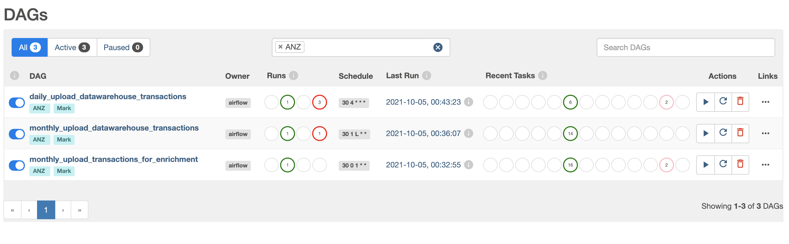
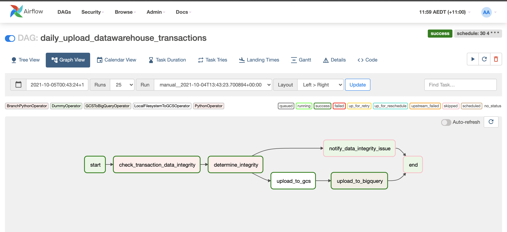
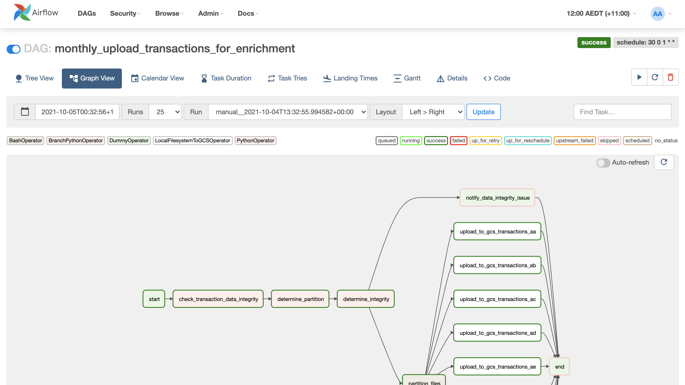
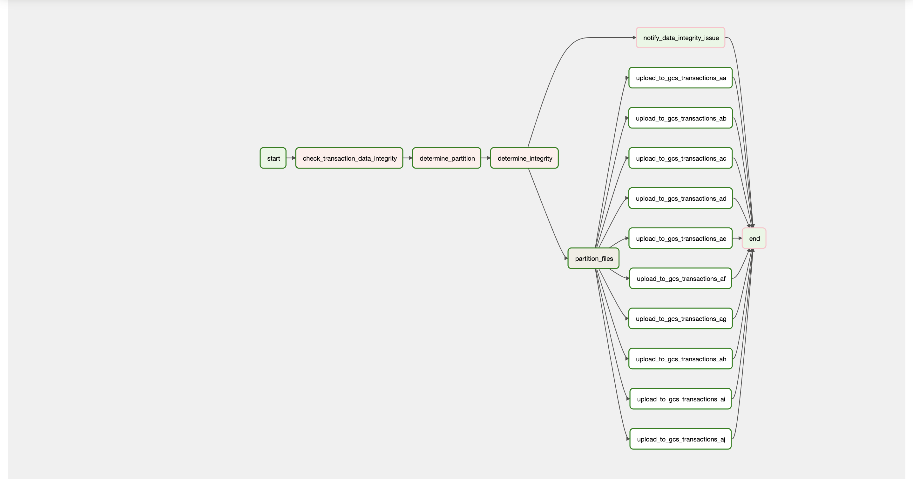
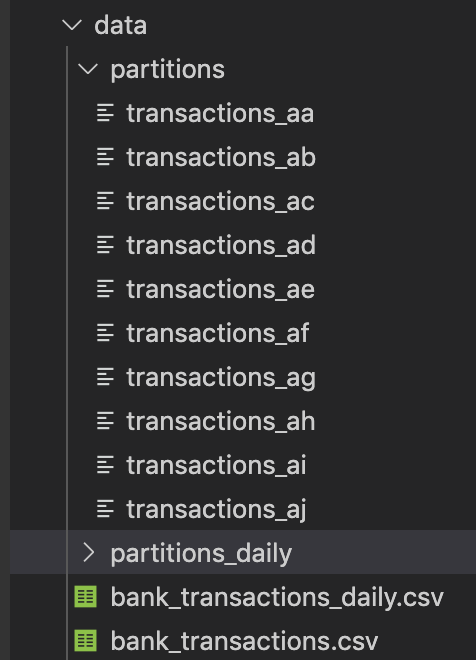
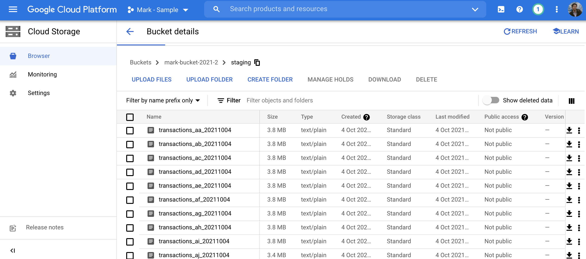
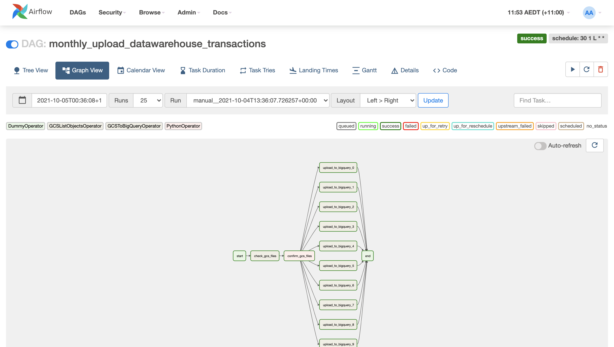
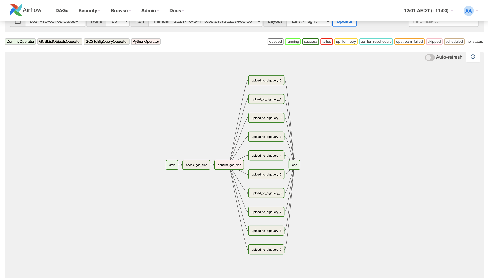
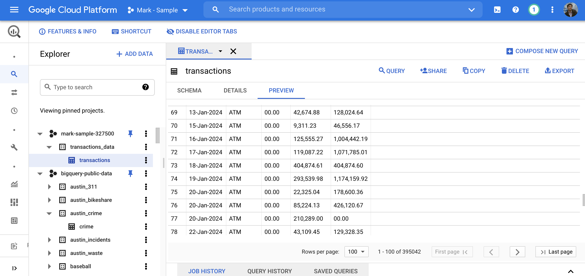

# ETL Exercise

Created by: **Mark Jose**

Date: **5 October 2021**

## Problem Description

### Background


There is an upcoming requirement for using transaction data to analyse the impact of consumer's spending before, during and after COVID snap lockdown. The bank needs to load retail transaction data from UNIX server (on-premises) to a Cloud Platform Big Data Storage so that Data Scientist team can build analytics features from it.

About the data, it contains transactions from the payment ANZ terminals across Australia and the terminal information will be enriched by another department before sending to the cloud. The enrichment process will update some missing merchant information and it will take one month to be completed for two years of historical data.

Since it takes one month to enrich the historical data, the historical restate will happen monthly when the final table will be updated with the latest merchant information. In term of volume, two years of historical data is 600 GB in size. However, the infrastructure is only capable of transferring 30GB of data at a time and therefore the historical data must be split before sending to the cloud.

On the other hand, some use-cases does not require the latest merchant details. Hence, a daily load is needed to send transaction data to the cloud every day without waiting for them to be enriched. Those records will be updated later on the cloud with the latest merchant information when the historical restate happens. The daily load contains data from the past 21 days, and it is 25 GB in size (for each load).

### Task

Your task is to design an ETL solution that meets the requirements above. You're free to demonstrate your idea by proposing a synthetic transaction dataset. You're also free to make any assumptions but they must be realistic assumptions.

## Solution Design

From my understanding, here are the **business rules**:

1. There will be a **monthly process** of enriching historical data transactions, with transactions ranging from today - 2 years up to today. The data will be **600 GB**, and needs to be partitioned into **30 GB chunks** before sending into the cloud.
2. The **enrichment** will happen **within a month**. The historical transactions are uploaded every **first of the month**, enriched by another department, then uploaded into the data warehouse hosted in the cloud at the **last date of the month**. 
3. Together with this, a **daily upload of transactions** is also needed, with transactions ranging from today - 21 days up to today. These transactions are  worth **25 GB**, and are uploaded directly into the cloud.


The solution is implemented using **Apache Airflow** hosted in a **Docker Container**. Instructions to launch Airflow on Docker can be found [here](https://airflow.apache.org/docs/apache-airflow/stable/start/docker.html).


The solution is made up of *three scheduled jobs*, or in Airflow, **DAGs**:

| DAG name                                   | Description                                                                | Schedule                             | Source               | Destination          |
|--------------------------------------------|----------------------------------------------------------------------------|--------------------------------------|----------------------|----------------------|
| monthly_upload_transactions_for_enrichment | Uploads the historical transactions data into a GCS storage for enrichment | 1:30 am every first day of the month | local file system    | Google Cloud Storage |
| monthly_upload_datawarehouse_transactions  | Uploads the enriched transactions into a Cloud Data Warehouse              | 12:30 am every last day of the month | Google Cloud Storage | Google Bigquery      |
| daily_upload_datawarehouse_transactions    | Uploads the daily transactions data into the Cloud Data Warehouse          | 4:30 am every day                    | local file system    | Google Bigquery      |




Let's check each DAG one by one.


### daily_upload_datawarehouse_transactions
<br/>

This DAG is for transactions that do not require merchant details. The transactions are assumed to be **flat files** stored in an **on-prem server**, which is directly uploaded to the cloud data warehouse. The cloud data warehouse is assumed to be a **Google Bigquery dataset**.



In this example, the DAG attempts to do some data and metada checks before performing the actual job of uploading the file into the cloud. Then, it will pass into a conditional task. If the checks pass, it will upload the data into the cloud datawarehouse. If not, it will send a notification email, summarising the issues and data errors encountered. 

The source data is in the repo: `dags/data/bank_transactions_daily.csv`, and the final transaction is saved into `transactions_data.transactions` Bigquery table. 
<br/>

### monthly_upload_transactions_for_enrichment
<br/>

This DAG transfers the historical transaction data into a **Google Cloud Storage bucket** for enrichment.





First, it will do some data and metadata integrity checks, like comparing the parameters, analysing source data shape, schema, etc. before proceeding with the rest of the task. The transactions are assumed to be **flat files** stored in an **on-prem server**.

Since the data is huge, we partition the data into several chunks (using UNIX `split` command) before uploading it into the **Google Cloud Storage**. Airflow allows you to *dynamically implement tasks*, so the `upload_to_gcs_*` task is actually dependent on the number of chunks that the `partition_files` task produces. 

In this DAG, the source flat file **bank_transactions.csv** is divided into **10 partitions**:



The partition is based on **size**. In this task, we partition the dataset into **4 MB** chunks, for demonstration.

We then upload these files into GCS, with appended dates to the filename so we know when were they uploaded (altho the GCS metadata could easily tell us that too).




### monthly_upload_datawarehouse_transactions

This DAG uploads the enriched dataset from **Google Cloud Storage** into the **Google Bigquery** data warehouse.




We assume the *enrichment process* will get the data from GCS, add merchant details, and upload it back into GCS.
Therefore, we consider the data *enriched* after end of the month, whatever the state of the data is.

Once the enrichment process is over, the DAG will check for the existence of the files in the GCS directory where *enriched* datasets is.
Once verified, it will dynamically spun `upload_to_bigquery_*` tasks to transfer the data into Google Bigquery, depending on the number of files in the GCS directory.




## Solution Setup

Prerequisites: You should have Docker and Python installed on your machine.

1. Clone this repository
2. Check out `docker_commands.sh` for instructions on how to run this via a Docker container
3. Once the container is up, go to `http://localhost:8080` to view Airflow web interface (uid and pwd are airflow)


## Limitations

Due to time and resource constraints, there were some shortcuts implemented in this solution:

- The synthetic dataset is not 600 GB but around 40 MB, to allow me to develop the solution much quicker.
- There are lax data integrity checks for now; ie the solution will only demo a ~happy path~, the connection info are also stored inside the repo for brevity, and the credentials are also in code.
- The solution does not feature data period checks; ie it currently lacks checks if the transactions are from 2 years or 21 days from now. It is assumed it will be done in the data integrity task.
- The IAM roles are also relaxed; ie this solution assumes the DAGs have admin access to all its required storage/repos.
- The data is made up of independent transactions (even though by nature rows are actually dependent to each other), this means we could uploaded the file into the cloud in parallel. 
- The enrichment process is done externally--other departments will retrieve the file from GCS and put them back into the same directory, with the same filename
- The demo solution only appends the data into the data warehouse. Ideally, the task should just update the row if it is already in the tables.
- The demo solution also does not feature a task that deletes the files from GCS once uploaded to Bigquery, although ideally, it should.


## Considerations

**Tools and Storage Choices**

I used **Apache Airflow** to setup the ETL pipelines. **Airflow** is a job scheduler that runs a collection of tasks with defined dependencies. Workflows (or jobs) are written as code of Directed Acyclic Graph (DAG), which are executed from left to right. It is also developed in Python, so third-party support is plenty and is easily extensible. 

I used **Google Cloud Storage** as a staging repository for the files because it can store any kind of data durably and securely. It also allows us to access the files via API and integrate it not only with other GCP services (like **Dataproc** and **Bigquery**) but also third-party ETL tools like **Apache Airflow**.

I used **Google Bigquery** as the cloud data warehouse. Bigquery is tailored for analysing big data, where we need to perform a lot of ad-hoc reads to the dataset with very large volumes. It's fast and easy to integrate with a lot of data engineering tools because of its extensive REST API. In some cases, it allows you to run complex analytical SQL-based queries under large sets of data up to 50x faster than traditional databases hosted on-prem.

**Daily Problems/Issues**

Here are some of the issues we may encounter:

1. **The source file is corrupted/there are issues with the data** - This can be mitigated by Airflow. The dependencies in a DAG ensures jobs won't go to the next step unless the previous step is successful. It also  shows a lot of information for every job runs, like the execution logs, outputs, and duration.
2. **Jobs are taking too long to execute/stuck** - Airflow features a robust set of interfaces to diagnose and determine any bottlenecks in the job.
3. **Uploading data to cloud fails/network connectivity is spottty** - Allowing Airflow to be hosted in any PaaS like GCP Cloud Composes or in AWS Managed Workflows mitigates any infrastructure or network issues.

## Demo

The source files are located in this repo.
To check the destination repo, you may try and access the following GCP services:

```
BUCKET_NAME = 'mark-bucket-2021-2'
BIGQUERY_TABLE = 'transactions_data.transactions'
```

Note that due to IAM restrictions, you might be prevented from seeing the files unless I perform a demo.
